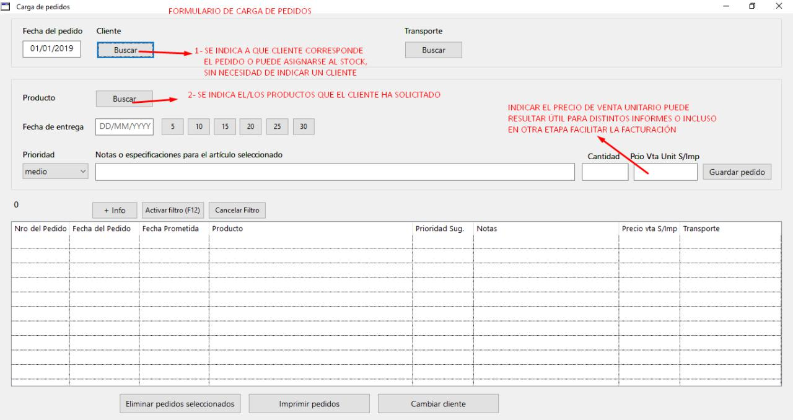
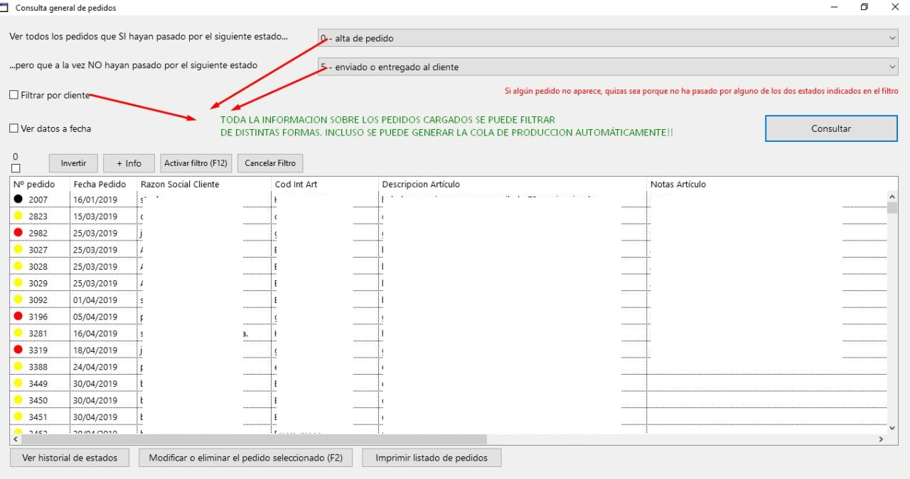
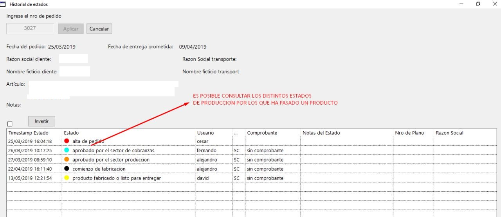
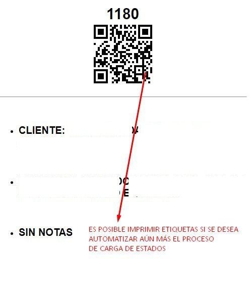
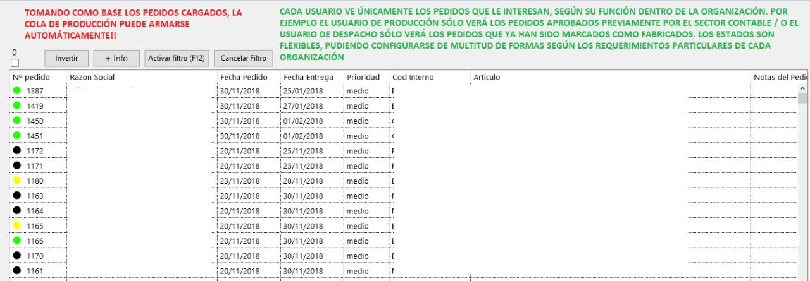
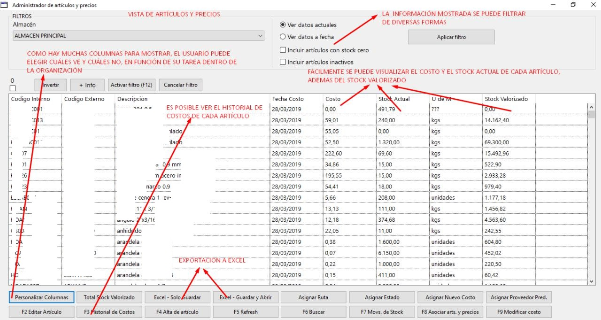
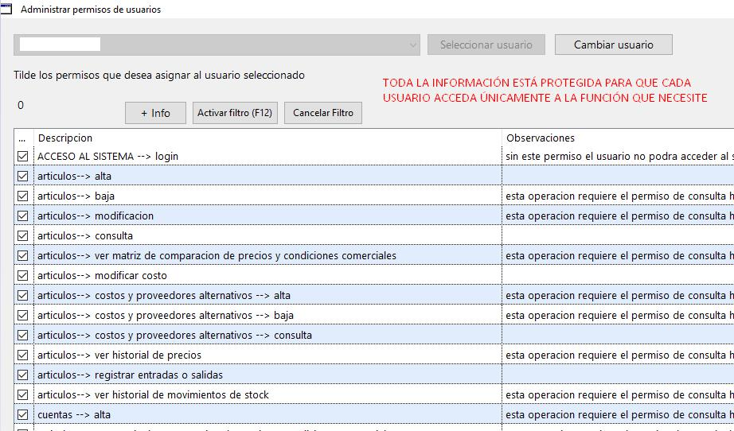
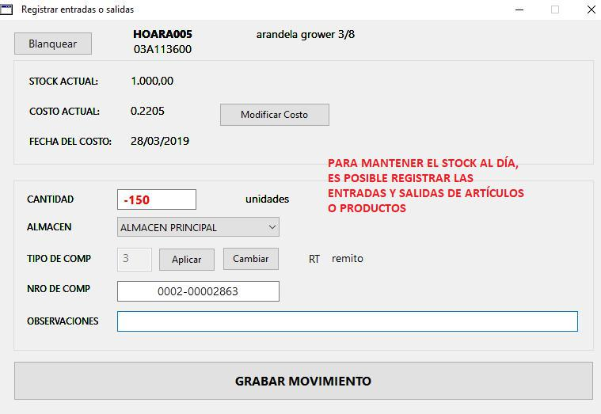
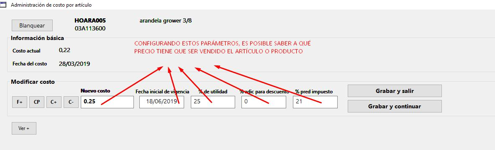
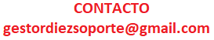

## Algunas de las funciones de gestordiez

**Carga de pedidos**

**Consulta general de pedidos**

**Historial de estados de producción**

**Impresión de etiquetas con códigos de barra o QR**

**Planificación o cola de producción**

**Administración de artículos y precios**

**Configuración de permisos por usuario**

**Registro de entradas o salidas de artículos o productos**

**Configuración de costos y precios de venta**

## Gestordiez es un software en constante evolución. Características o funciones personalizadas pueden ser desarrolladas a la medida de su necesidad u organización

